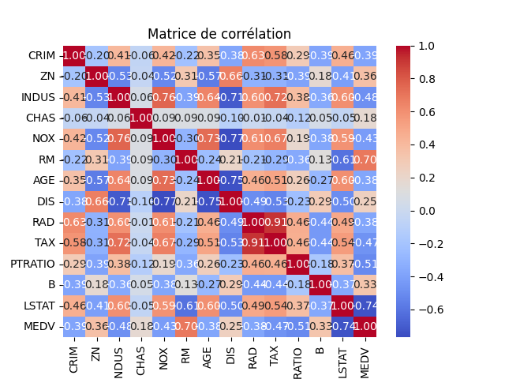
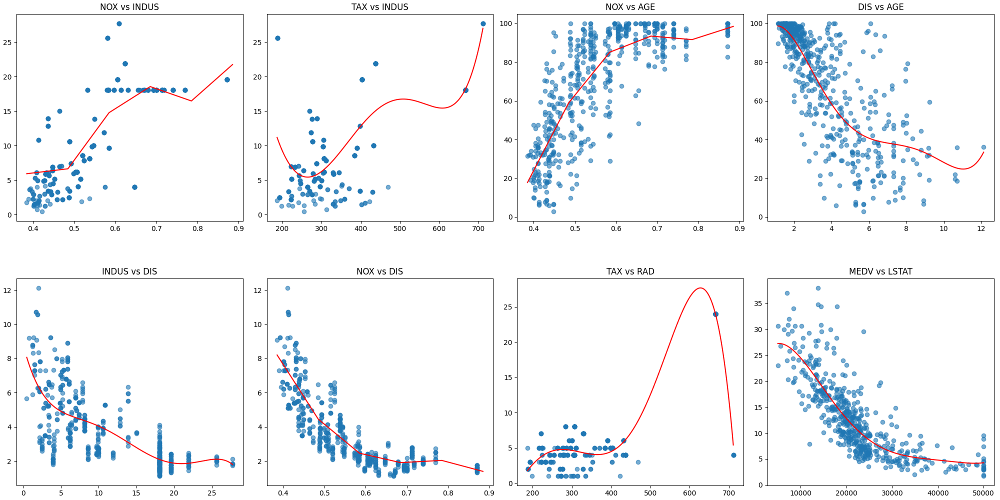
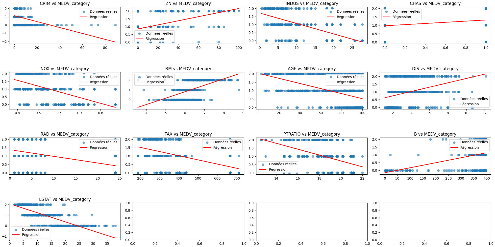
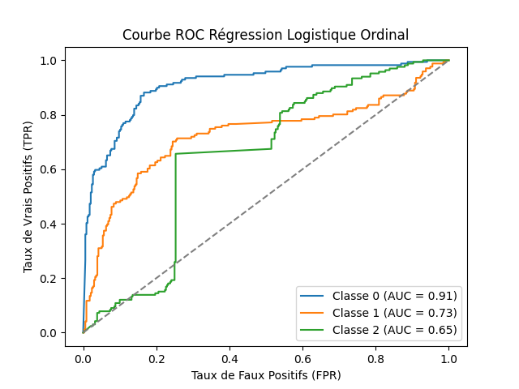

# 📌 4ème rendu : Ordinal Classification avec PCA et Analyse de Corrélation

## 📝 Description du Rendu

Ce projet implémente une classification ordinale en combinant plusieurs techniques d'analyse de données, notamment :

* L'analyse de corrélation entre les variables
* La régression linéaire pour les variables fortement corrélées
* La transformation d'une variable cible en une variable catégorielle
* L'application de l'Analyse en Composantes Principales (PCA)
* L'évaluation des performances du modèle et comparaison avec d'autres modéles avec des courbes ROC

## 📂 Structure du Rendu

Le projet est organisé comme suit :

* `OrdinalClassification.py` : Classe implémentant la régression logistique ordinale.
* `LogistiqueRegression.py` : Implémentation de la régression logistique standard.
* `Scaler.py` : Classe implémentant la normalisation min et max.
* `PolynomialRegression.py` : Classe implémentant la régression polynomiale, calcule le MSE & R² et normalise avec Scaler.py.

## 🚀 Lancement

```
	python app.py
```

    ou

```
	python3 app.py

```

## 🧠 Utilisation de la PCA

L'Analyse en Composantes Principales (PCA) a été utilisée pour réduire la dimensionnalité du jeu de données, afin de :

* **Simplifier le modèle** tout en conservant l'information essentielle.
* **Améliorer les performances** en éliminant les variables redondantes ou peu informatives, ce qui permet de réduire le bruit et prévenir le sur-apprentissage.
* **Rendre les variables moins corrélées** en transformant les données de manière à ce que les nouvelles composantes principales soient indépendantes entre elles.Faciliter l'interprétation et la visualisation des données en projetant celles-ci dans un espace de dimension réduite.

## 📊 Résultats

* **Matrice de corrélation** : Identification des variables fortement corrélées pour mieux orienter la régression.
* **Régressions linéaires** : Analyse des relations entre variables corrélées.
* **Test de Spearman** : Corrélations significatives entre les variables, par exemple :
  * **MEDV x LSTAT** : Corrélation négative forte (-0.85), indiquant que le prix des maisons diminue avec un statut socio-économique plus bas.
  * **MEDV x RM** : Corrélation positive forte (0.63), suggérant que plus de pièces par logement est associé à un prix plus élevé.
* **Test de Chi2** : Mise en évidence de relations entre la variable cible et des variables qualitatives :
  * **MEDV_category x RAD** : Relation forte avec le nombre de routes accessibles (p < 0.05).
  * **MEDV_category x CHAS** : Relation plus faible avec la proximité de la rivière Charles (p ≈ 0.05).
* **Test d'ANOVA** : Impact des variables continues sur `MEDV_category` :
  * **RM** : Plus de pièces par logement est associé à un prix plus élevé (p ≪ 0.05).
  * **LSTAT** : Un statut socio-économique plus bas correspond à des prix plus faibles (p ≪ 0.05).
* **Analyse comparative des modèles** : La régression logistique ordinale avec PCA atteint une précision moyenne de  57 % , avec une meilleure prédiction des classes  0 et 2 , tandis que la classe 1 reste plus difficile à classifier. En revanche, Random Forest et XGBoost affichent une précision  parfaitement optimisée (100%) , ce qui peut indiquer un sur-apprentissage. SVM offre un bon compromis avec une précision de  83 % , montrant une capacité de généralisation supérieure à la régression logistique tout en évitant l'overfitting observé avec les modèles d'ensemble.

### **📸 Sorties**

#### 📈 Graphiques

##### 1/ Matrice de corrélation



##### 2/ Régression des variables fortement corrélées



##### 3/ Régressions linéaires entre les entrées et la sortie (transformée en variable catégorielle)



##### 4/ Régression Logistique x PCA



##### 5/ Courbes ROC Comparaison


#### 💻 Terminal

Regression logistique - Cross Validation - Accuracy : 0.5688
Rapport de Classification :
               precision    recall  f1-score   support

    0       0.51      0.85      0.64       169
           1       0.63      0.34      0.44       171
           2       0.66      0.52      0.58       166

    accuracy                           0.57       506
   macro avg       0.60      0.57      0.55       506
weighted avg       0.60      0.57      0.55       506

Random Forest - Cross Validation - Accuracy : 0.7846
Rapport de Classification :
               precision    recall  f1-score   support

    0       0.88      0.80      0.84       169
           1       0.67      0.77      0.72       171
           2       0.83      0.78      0.80       166

    accuracy                           0.78       506
   macro avg       0.80      0.78      0.79       506
weighted avg       0.79      0.78      0.79       506

XGBoost - Cross Validation - Accuracy : 0.7747
Rapport de Classification :
               precision    recall  f1-score   support

    0       0.83      0.81      0.82       169
           1       0.69      0.71      0.70       171
           2       0.82      0.81      0.81       166

    accuracy                           0.77       506
   macro avg       0.78      0.78      0.78       506
weighted avg       0.78      0.77      0.78       506

SVM - Cross Validation - Accuracy : 0.5119
Rapport de Classification :
               precision    recall  f1-score   support

    0       0.68      0.63      0.65       169
           1       0.33      0.19      0.24       171
           2       0.48      0.73      0.58       166

    accuracy                           0.51       506
   macro avg       0.50      0.51      0.49       506
weighted avg       0.50      0.51      0.49       506

## ✨ Auteurs

Ce projet a été réalisé dans le cadre de l'analyse et la modélisation de données avec une approche de classification ordinale et réduction de dimension.
