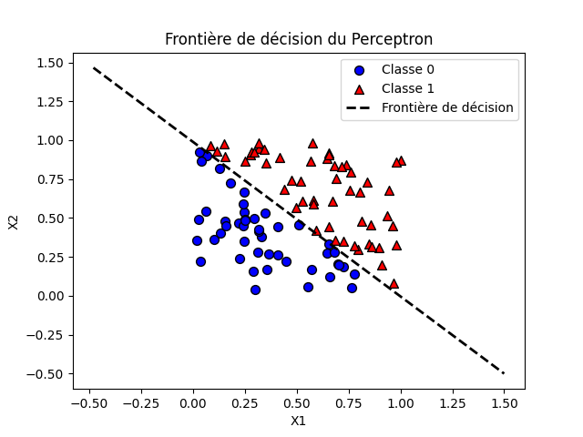
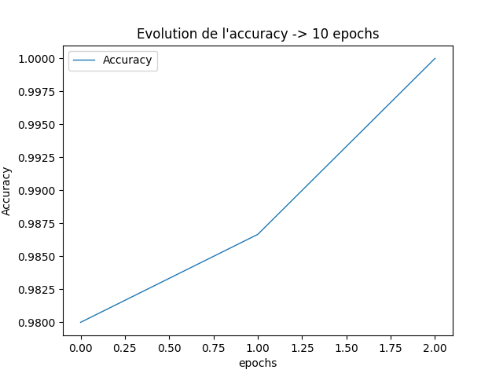
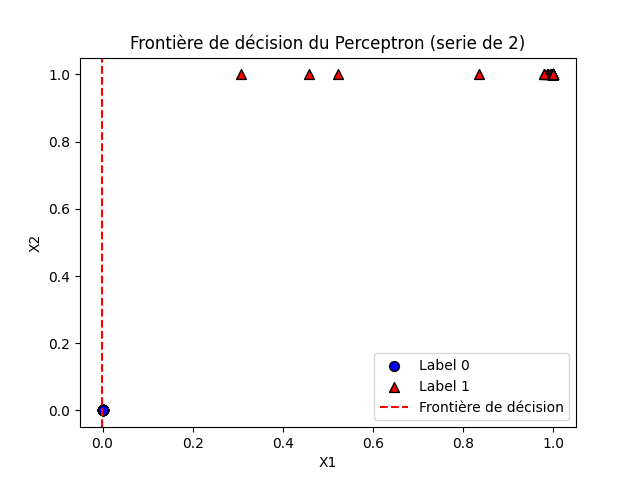
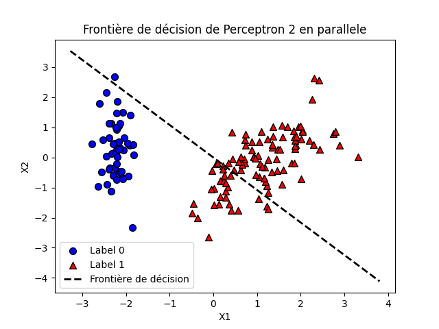

# 📌 5ème rendu : Perceptron

## 📝 Description du Rendu

Le projet consiste en l'implémentation et l'entraînement d'un perceptron pour la classification binaire. Il est structuré de manière à permettre une visualisation des données ainsi que de la frontière de décision qui sépare les deux classes. Le perceptron utilise une fonction d'activation de type seuil (step function) pour effectuer les prédictions.

### Objectifs du Projet :

- **Génération des Données** : Création de 100 points aléatoires en 2 dimensions, chaque point étant classé en fonction de la somme de ses coordonnées (s'il est supérieur à 1, il appartient à la classe "Label 1", sinon à la classe "Label 0").
- **Implémentation du Perceptron** : Création d'une classe `Perceptron` permettant d'initialiser les paramètres d'entraînement (taux d'apprentissage, nombre d'itérations, poids, biais), d'effectuer la fonction d'activation, d'entraîner le modèle et de faire des prédictions.
- **Visualisation** : Affichage des points sur un graphique, avec un code couleur pour les classes "Label 0" et "Label 1", ainsi que la frontière de décision obtenue par le perceptron.
- **Tests Comparatifs** : Comparaison des performances entre différents modèles :

  - Un perceptron simple.
  - Deux perceptrons en série.
  - Deux perceptrons en parallèle.

## 📂 Structure du Rendu

Le projet est organisé comme suit :

* `Perceptron.py` : Contient la classe `Perceptron`, avec ses méthodes pour l'entraînement et la prédiction des données.
* `app.py` : Exécute l'entraînement et affiche les résultats avec les graphes de précision et la frontière de décision.

## 📚 Mémo sur le Perceptron

### Qu'est-ce qu'un Perceptron ?

Le perceptron est un modèle de réseau de neurones artificiels utilisé pour les tâches de classification binaire. Il est composé de plusieurs entrées, de poids associés à chaque entrée, d'un biais, et d'une fonction d'activation. Le perceptron est un classificateur linéaire, ce qui signifie qu'il sépare les données en deux classes via une frontière linéaire.

### Fonctionnement du Perceptron

1. **Entrées et Poids** :Soit un vecteur d'entrées X = (x_1, x_2, ..., x_n) et des poids W = (w_1, w_2, ..., w_n), associés à un biais b.
2. **Calcul de la Sortie** :La sortie z est une combinaison linéaire des entrées et des poids :
   - z = X . W + b
3. **Fonction d'Activation (Seuil)** :La sortie z passe par une fonction d'activation (step function) qui retourne :
   - y = 1 si z >= 0, 0 sinon
4. **Entraînement** :Les poids sont ajustés à chaque itération selon la règle de mise à jour :
   - W <- W + aplha * (y_true - y_pred) . X
   - b <- b + aplha * (y_true - y_pred)
     Où alpha est le taux d'apprentissage.
5. **Prédiction** :
   Une fois entraîné, le perceptron prédit la classe d'un nouvel exemple en utilisant la fonction d'activation avec les poids et le biais appris.

### Calculs Associés

- **Sortie du perceptron** :
  - z = X . W + b
- **Mise à jour des poids** :
  - W <- W + aplha * (y_true - y_pred) . X
- **Fonction d'activation** :
  - y = 1 si z >= 0, 0 sinon

## 🚀 Lancement

```
	python app.py
```

    ou

```
	python3 app.py

```

## **📸 Sorties**

#### 📈 Graphiques

##### 1/ Perceptron simple



##### 2/ Régression des variables fortement corrélées



##### 3/ Deux perceptron en serie



##### 4/ Deux perceptron en parallèle



## ✨ Auteurs

Ce projet a été réalisé dans le cadre de l'analyse et la modélisation de données avec une approche de classification ordinale et réduction de dimension.
