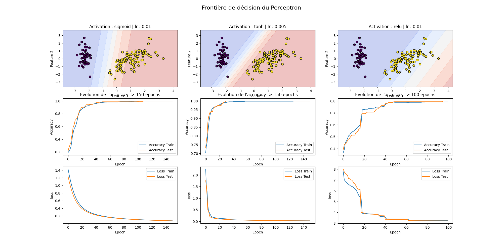
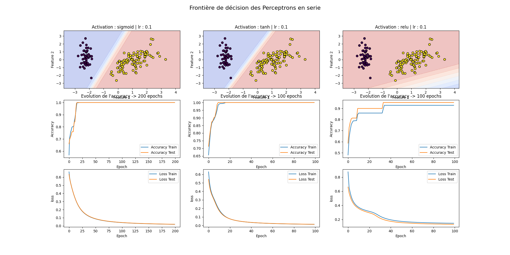
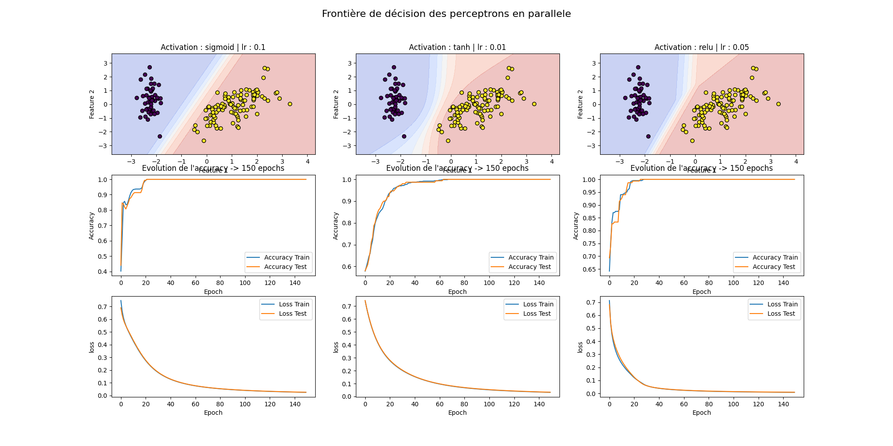

# 📌 6ème rendu : Perceptron - Tensorflow

## 📝 Description du Rendu

Ce projet a pour objectif de comparer différentes architectures de perceptrons et fonctions d'activation sur deux jeux de données distincts :

1. Un dataset généré aléatoirement, puis standardisé.
2. Le dataset Iris, chargé depuis les bases de données standards et transformé par une Analyse en Composantes Principales (PCA) pour une projection en 2D.

L'analyse vise à observer l'impact de ces choix sur la frontière de décision et l'évolution des métriques d'évaluation.

## 🎯 Objectifs du Projet

L'expérimentation porte sur les configurations suivantes :

* Un perceptron unique.
* Deux perceptrons en série.
* Deux perceptrons en parallèle.

Chacune de ces architectures est testée avec les trois fonctions d'activation suivantes :

* Sigmoïde
* Tangente hyperbolique
* Rectified Linear Unit

## 📊 Métriques d'évaluation

Pour chaque combinaison, les résultats sont analysés à travers :

* **La frontière de décision**, affichée graphiquement pour une meilleure visualisation des zones de classification.
* **L'évolution de l'accuracy en cross-validation**, permettant d'observer la performance du modèle en fonction des itérations d'entraînement.
* **L'évolution de la loss en cross-validation**, afin de suivre la convergence du modèle.

## 📂 Structure du Rendu

Le projet est organisé comme suit :

* `app.py` : Exécute l'entraînement et affiche les résultats avec les graphes de précision et la frontière de décision.

## Étude du Dataset Iris

Il contient des informations sur **150 iris** répartis en trois classes :  **Iris-setosa** ,  **Iris-versicolor** , et  **Iris-virginica** , avec 50 échantillons par classe. Chaque échantillon est décrit par **quatre caractéristiques** :

1. La longueur du sépale
2. La largeur du sépale
3. La longueur du pétale
4. La largeur du pétale

Ces caractéristiques sont des variables quantitatives continues et mesurées en centimètres.

Pour cet exercice, nous avons réduit le problème à un cas binaire où la classe Iris-setosa (Label 0) est séparée des autres classes (Label 1). L'objectif est de classer les iris en deux catégories, et nous avons utilisé la réduction de dimensionnalité avec PCA pour simplifier les données tout en conservant 95 % de la variance d'origine.

#### Conclusion

L'utilisation de la réduction de dimensionnalité avec PCA a grandement facilité la tâche de classification. Le  Perceptron, même avec sa simplicité, a réussi à  séparer efficacement les classes . La visualisation des frontières de décision montre que les données sont bien séparées dans l'espace transformé par PCA, ce qui illustre l'efficacité de cette approche pour des problèmes de classification simples.

## 🚀 Lancement

```
	python app.py
```

    ou

```
	python3 app.py

```

## **📸 Sorties**

#### 📈 Graphiques

##### Dataset aléatoire

###### 1/ Perceptron simple


###### 2/ Deux perceptrons en serie


###### 3/ Deux perceptrons en parallèle


##### Dataset iris

###### 1/ Perceptron simple



###### 2/ Deux perceptrons en serie



###### 3/ Deux perceptrons en parallèle



## ✨ Auteurs

Ce projet a été réalisé dans le cadre de l'analyse et la modélisation de données avec une approche de classification ordinale et réduction de dimension.
