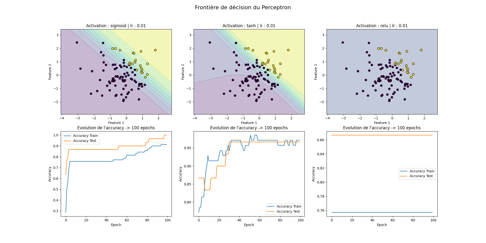
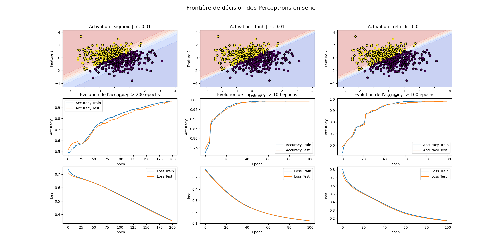
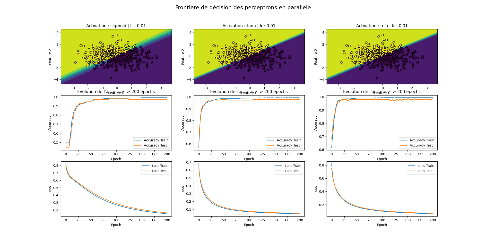

# 📌 6ème rendu : Perceptron - Tensorflow

## 📝 Description du Rendu

Le projet consiste en l'implémentation et l'entraînement d'un perceptron pour la classification binaire. Il est structuré de manière à permettre une visualisation des données ainsi que de la frontière de décision qui sépare les deux classes. Le perceptron utilise une fonction d'activation de type seuil (step function) pour effectuer les prédictions.

### Objectifs du Projet :

- **Génération des Données** : Importation du dataset Iris, suivi d'une réduction de dimensionnalité via l'Analyse en Composantes Principales (PCA) pour ne conserver que les deux premières dimensions principales. Ce processus permet de visualiser et classifier les données dans un espace 2D tout en conservant un maximum d'information.
- **Implémentation du Perceptron** : Création d'une classe `Perceptron` permettant d'initialiser les paramètres d'entraînement (taux d'apprentissage, nombre d'itérations, poids, biais), d'effectuer la fonction d'activation, d'entraîner le modèle et de faire des prédictions.
- **Visualisation** : Affichage des points sur un graphique, avec un code couleur pour les classes "Label 0" et "Label 1", ainsi que la frontière de décision obtenue par le perceptron.
- **Tests Comparatifs** : Comparaison des performances entre différents modèles :

  - Un perceptron simple.
  - Deux perceptrons en série.
  - Deux perceptrons en parallèle.

## 📂 Structure du Rendu

Le projet est organisé comme suit :

* `Perceptron.py` : Contient la classe `Perceptron`, avec ses méthodes pour l'entraînement et la prédiction des données.
* `app.py` : Exécute l'entraînement et affiche les résultats avec les graphes de précision et la frontière de décision.

## Étude du Dataset Iris

Il contient des informations sur **150 iris** répartis en trois classes :  **Iris-setosa** ,  **Iris-versicolor** , et  **Iris-virginica** , avec 50 échantillons par classe. Chaque échantillon est décrit par **quatre caractéristiques** :

1. La longueur du sépale
2. La largeur du sépale
3. La longueur du pétale
4. La largeur du pétale

Ces caractéristiques sont des variables quantitatives continues et mesurées en centimètres.

Pour cet exercice, nous avons réduit le problème à un cas binaire où la classe Iris-setosa (Label 0) est séparée des autres classes (Label 1). L'objectif est de classer les iris en deux catégories, et nous avons utilisé la réduction de dimensionnalité avec PCA pour simplifier les données tout en conservant 95 % de la variance d'origine.

#### Conclusion

L'utilisation de la réduction de dimensionnalité avec PCA a grandement facilité la tâche de classification. Le  Perceptron, même avec sa simplicité, a réussi à  séparer efficacement les classes . La visualisation des frontières de décision montre que les données sont bien séparées dans l'espace transformé par PCA, ce qui illustre l'efficacité de cette approche pour des problèmes de classification simples.

## 🚀 Lancement

```
	python app.py
```

    ou

```
	python3 app.py

```

## **📸 Sorties**

#### 📈 Graphiques

##### 1/ Perceptron simple



##### 3/ Deux perceptron en serie



##### 4/ Deux perceptron en parallèle



## ✨ Auteurs

Ce projet a été réalisé dans le cadre de l'analyse et la modélisation de données avec une approche de classification ordinale et réduction de dimension.
