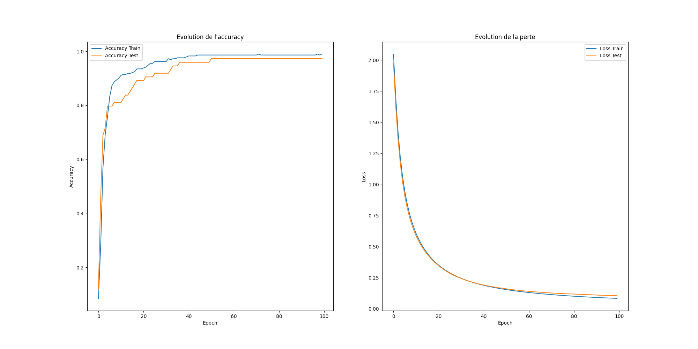
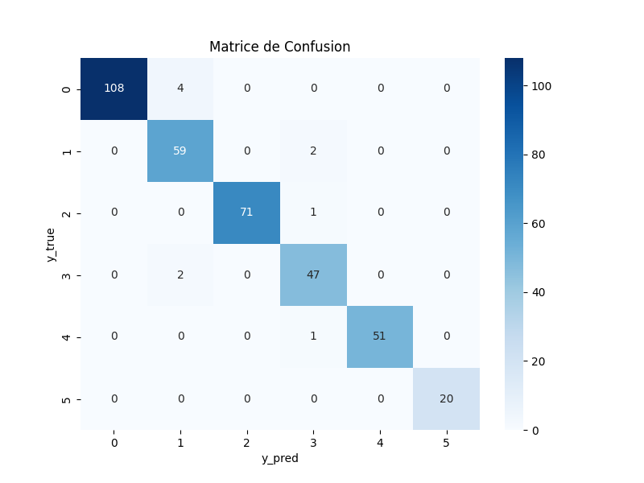

# 📌 7ème rendu : Classification Dermatologique avec Réseau de Neurones

## 📝 Description du Rendu

Ce projet met en place un modèle de réseau de neurones en utilisant TensorFlow/Keras afin de classifier des maladies dermatologiques selon leur gravité. L'approche adoptée inclut une validation croisée (K-Fold) pour garantir une meilleure généralisation du modèle.

## 🏆 Objectifs du projet

- Prétraiter les données dermatologiques et entraîner un modèle de classification.
- Atteindre une précision globale > **90%**.
- Afficher et sauvegarder les performances via une **matrice de confusion**.

## 📊 Résultats

### 🎯 **Précision globale obtenue**

* Les performances sont évaluées via la **moyenne des 5 folds**.

### 📈 **Visualisation des performances**

* **Graphique Accuracy vs Loss** : Permet d’évaluer la convergence du modèle.
* **Matrice de confusion** : Analyse des erreurs de classification.

## 📂 Structure du Rendu

📁 rendu_7/
 ├── 📁 csv_files/
 │   ├── dermatologie.csv
 ├── 📁 img/
 │   ├── accuracy_loss.png  # Graphique de l'évolution de l'accuracy et de la perte
 │   ├── matrice_confusion.png  # Matrice de confusion finale
 ├── app.py  # Script d'entraînement du modèle
 ├── README.md  # Documentation du projet

## 🚀 Lancement

```
	python app.py
```

    ou

```
	python3 app.py

```

## **📸 Sorties**

#### 📈 Graphiques

##### 1/ Accuracy & Loss



##### 2/ Matrice de confusion


