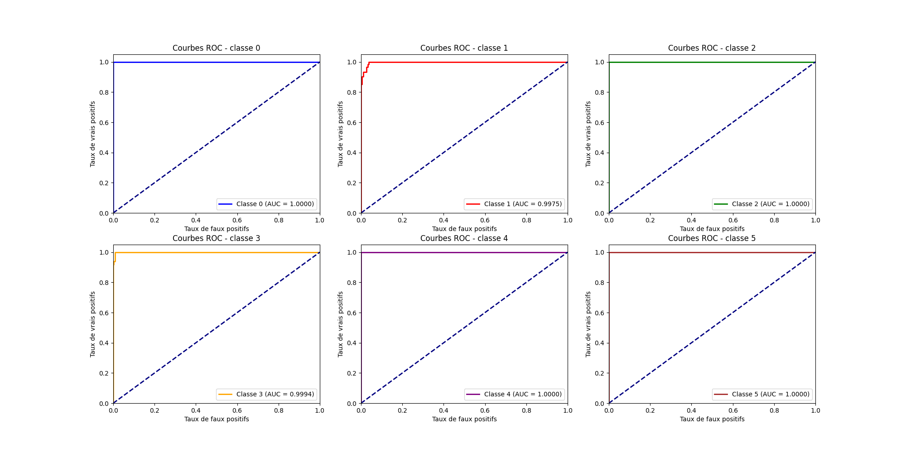

# 📌 7ème rendu : Classification Dermatologique avec Réseau de Neurones

## 📝 Description du Rendu

Ce projet met en place un modèle de réseau de neurones en utilisant TensorFlow/Keras afin de classifier des maladies dermatologiques selon leur gravité. L'approche adoptée inclut une validation croisée (K-Fold) pour garantir une meilleure généralisation du modèle.

## 🏆 Objectifs du projet

- Prétraiter les données dermatologiques, pondérer les classes et entraîner un modèle de classification.
- Atteindre une précision globale > 90%.
- Afficher et sauvegarder les performances via une matrice de confusion.

## 📊 Résultats

### 🎯 **Précision globale obtenue**

* Les performances sont évaluées via la moyenne des 5 folds.

### 📈 **Visualisation des performances**

* Graphique Accuracy vs Loss : Permet d’évaluer la convergence du modèle.
* Matrice de confusion : Analyse des erreurs de classification.
* Courbes ROC : Compare le taux de vrais positifs au taux de faux positifs.

## 📂 Structure du Rendu

📁 rendu_7/
 ├── 📁 csv_files/
 │   ├── dermatologie.csv
 ├── 📁 img/
 │   ├── accuracy_loss.png
 │   ├── matrice_confusion.png
 ├── app.py 		 # Script d'entraînement du modèle
 ├── README.md

## Dataset Dermatologie

Ce dataset contient des caractéristiques cliniques et histopathologiques liées à des maladies dermatologiques, avec des colonnes décrivant des symptômes (ex. érythème, desquamation) et des observations microscopiques (ex. acanthose, microabcès). La colonne 'classe' représente la maladie à prédire (6 classes possibles). L'objectif est de classifier les maladies en fonction des variables présentes.

## 🚀 Lancement

```
	python app.py
```

    ou

```
	python3 app.py

```

## **📸 Sorties**

#### 📈 Graphiques

##### 1/ Accuracy & Loss


##### 2/ Matrice de confusion


3/ Courbe ROC


