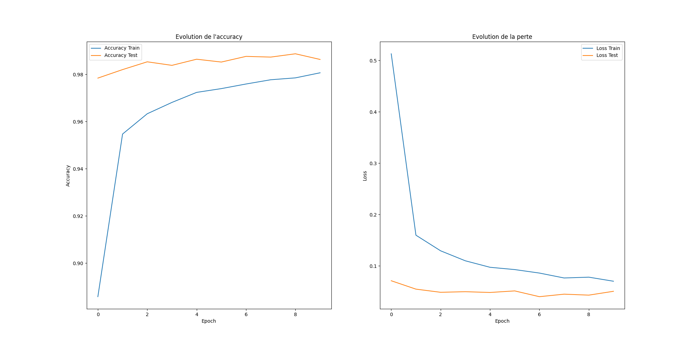
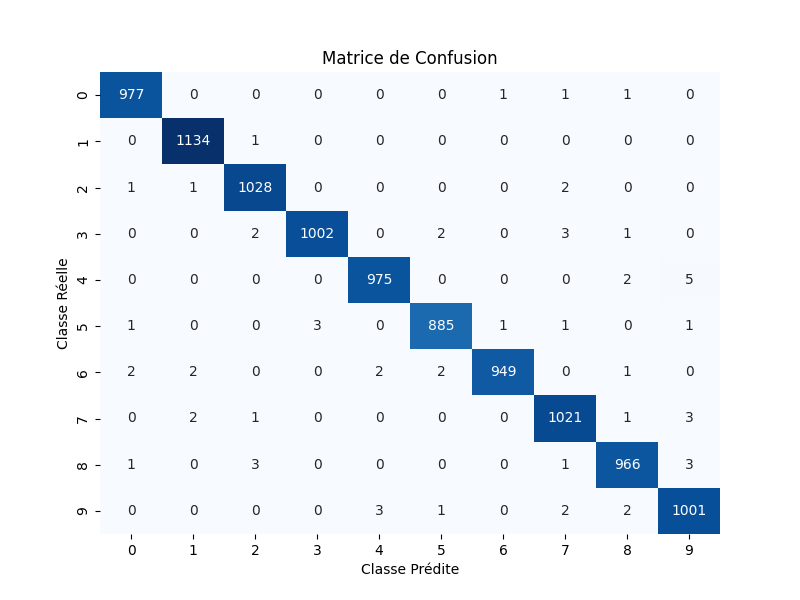
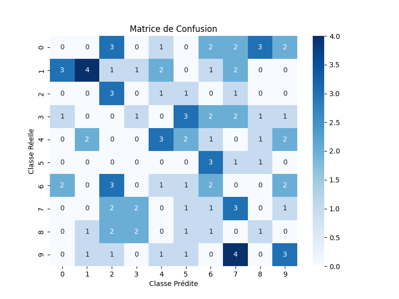

# 📌 8ème rendu : Classification D'images - CNN

## 📝 Description du Rendu

Ce projet consiste en la mise en place d'un modèle de classification d'images basé sur un réseau de neurones convolutifs (CNN). L'objectif principal est d'entraîner un modèle sur le dataset MNIST afin de reconnaître des chiffres manuscrits. Le projet inclut également une expérimentation sur des images modifiées en augmentant leur taille et en les repositionnant de manière aléatoire avant de les réduire à la taille originale.

## 🏆 Objectifs du projet

* Construire un modèle CNN performant pour la classification des chiffres manuscrits du dataset MNIST.
* Visualiser l'évolution des métriques d'apprentissage (accuracy et loss).
* Générer et tester des images altérées pour observer la robustesse du modèle.
* Analyser les performances à l'aide de métriques telles que la matrice de confusion et le rapport de classification.

## 📊 Résultats

* **Performance du modèle** : Le modèle a été entraîné sur 10 époques et a atteint un niveau de précision significatif sur l'ensemble de test.
* **Visualisation des métriques** : Des graphiques d'évolution de l'accuracy et de la perte ont été générés pour mieux comprendre l'apprentissage du modèle.
* **Expérimentation sur images altérées** : Un ensemble d'images a été modifié pour tester la robustesse du modèle, et les résultats ont été analysés à l'aide d'une matrice de confusion.

## 📂 Structure du Rendu

├── model/                  		 # Dossier contenant le modèle entraîné
│   ├── mon_model.keras      # Modèle sauvegardé
├──img/
│   ├── accuracy_loss.png
│   ├── matrice_conf_1.png   # Matrice de confusion - données MNIST
│   ├── matrice_conf_2.png   # Matrice de confusion - données créées
├── rendu_8.ipynb                 # Script principal contenant le code du modèle
├── README.md

## Dataset MNIST

Le dataset MNIST est un ensemble de données bien connu pour la classification d'images de chiffres manuscrits. Il contient :

* 60 000 images pour l'entraînement
* 10 000 images pour le test
  Chaque image est en niveaux de gris et de taille 28x28 pixels.

## 🚀 Lancement

```
	python app.py
```

    ou

```
	python3 app.py

```

## **📸 Sorties**

#### 📈 Graphiques

##### 1/ Accuracy & Loss



##### 2/ Matrice de confusion - tests MNIST




3/ Matrice de confusion - nouveaux tests


